# PlantUML Quick Reference Cheat Sheet

## Basic Diagram Types

### 1. Component Diagram
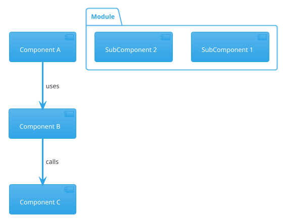

### 2. Sequence Diagram
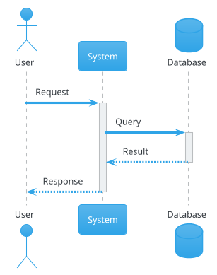

### 3. State Diagram
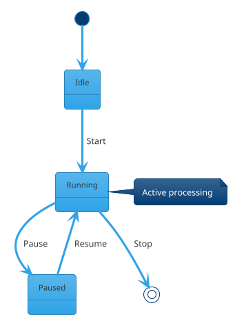

### 4. Activity Diagram (Data Flow)
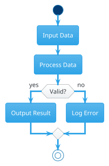

### 5. Class Diagram (Structures)
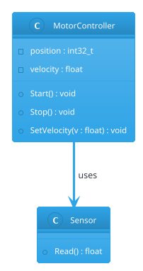

## Common Patterns for Embedded Systems

### Hardware + Firmware Layers
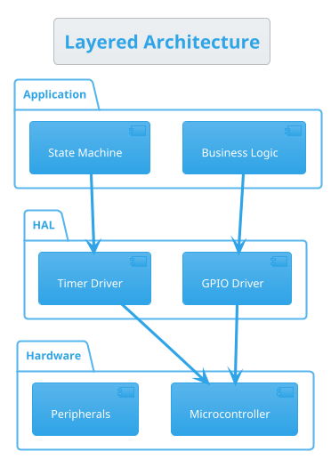

### Interrupt-Driven Flow
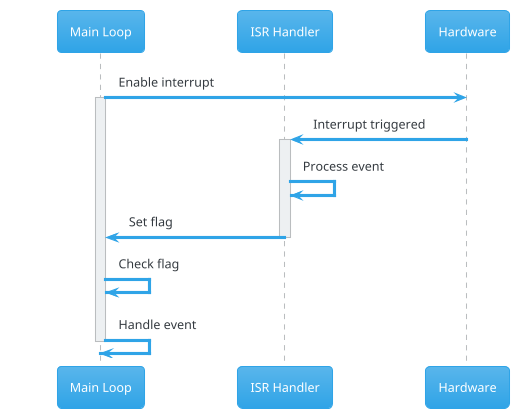

### Ring Buffer
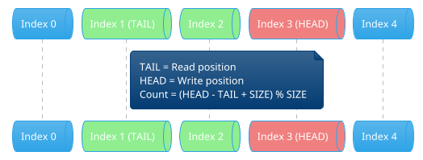

## Useful Styling

### Colors
```plantuml
component [Red Component] #Red
component [Green Component] #LightGreen
component [Blue Component] #LightBlue
component [Yellow Component] #Gold
component [Gray Component] #LightGray
```

### Arrows
```plantuml
A -> B : solid arrow
A --> B : dashed arrow
A -up-> B : arrow direction
A -[#Red]-> B : colored arrow
A -[#Red,dashed]-> B : colored dashed
A -[hidden]-> B : hidden (for layout)
```

### Notes
```plantuml
note right of Component
  This is a note
  on the right side
end note

note left of Component : Short note

note as N1
  Floating note
end note
```

### Themes
```plantuml
!theme cerulean    ' Professional blue
!theme plain       ' Simple black/white
!theme sketchy     ' Hand-drawn style
!theme amiga       ' Retro computer style
```

## Embedded-Specific Diagrams

### Timer Architecture
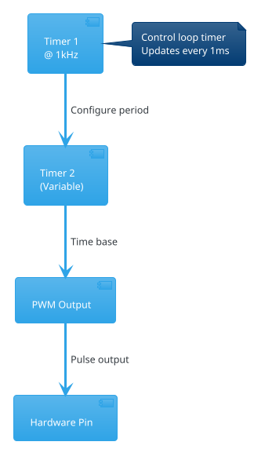

### Memory Map
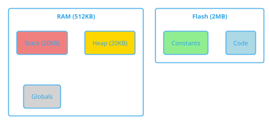

### State Machine with Timing
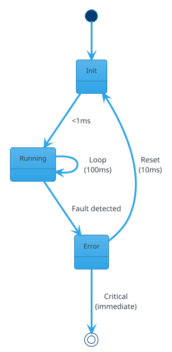

## Tips & Tricks

### 1. Layout Control
```plantuml
A -right-> B   ' Force direction (left, right, up, down)
A -[hidden]-> B  ' Hidden arrow for spacing
```

### 2. Grouping
```plantuml
package "Group Name" {
  [Component 1]
  [Component 2]
}

rectangle "Rectangle" {
  [Component 3]
}
```

### 3. Stereotypes
```plantuml
component [MyComponent] <<interface>>
component [MyDriver] <<hardware>>
component [MyAPI] <<library>>
```

### 4. Scale
```plantuml
@startuml
scale 1.5    ' Make diagram larger
scale 0.75   ' Make diagram smaller
@enduml
```

### 5. Line Breaks
```plantuml
component [Long Name\nWith Line Break]
note right
  Multi-line note
  Line 2
  Line 3
end note
```

## Export Commands

```bash
# PNG (raster image)
java -jar plantuml.jar -tpng diagram.puml

# SVG (scalable vector)
java -jar plantuml.jar -tsvg diagram.puml

# ASCII art (for documentation)
java -jar plantuml.jar -ttxt diagram.puml

# Multiple files
java -jar plantuml.jar *.puml
```

## VS Code Shortcuts

- `Alt + D` : Preview diagram
- `Ctrl + Shift + P` → "PlantUML: Export Current Diagram"
- `Ctrl + Shift + P` → "PlantUML: Export Workspace Diagrams"

## Common Mistakes

❌ **Wrong**: Forgetting `@startuml` / `@enduml`
✅ **Correct**: Always wrap diagram in these tags

❌ **Wrong**: Using spaces in identifiers without quotes
✅ **Correct**: Use [Component Name] or "Component Name" as CompName

❌ **Wrong**: Circular dependencies in component diagrams
✅ **Correct**: Layered architecture (no cycles)

❌ **Wrong**: Too much detail in one diagram
✅ **Correct**: Multiple focused diagrams (one concept each)

## Best Practices for Embedded Systems

1. **Start Simple**: High-level overview first, add detail incrementally
2. **Separate Concerns**: One diagram per concept (data flow, timing, dependencies)
3. **Use Layers**: Hardware → HAL → Application is natural for embedded
4. **Document Timing**: Sequence diagrams for interrupt flows are critical
5. **Show State**: State machines are everywhere in embedded systems
6. **Version Control**: Text files work great with Git
7. **Keep Updated**: Diagrams should match code (review in PRs)

## Resources

- **Official Docs**: https://plantuml.com/
- **Real Examples**: https://real-world-plantuml.com/
- **Online Editor**: https://www.plantuml.com/plantuml/uml/
- **VS Code Extension**: Search "PlantUML" by jebbs in Extensions
- **This Project**: See docs/plantuml/ for working examples

---

**Pro Tip**: Start every new embedded project by creating:
1. System overview diagram (hardware + firmware layers)
2. Data flow diagram (input → processing → output)
3. Module dependency diagram (what includes what)

These three diagrams will guide your entire architecture!
