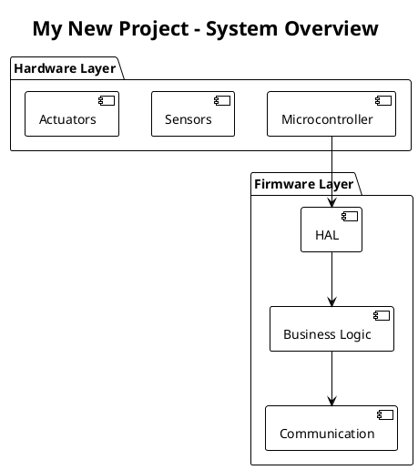
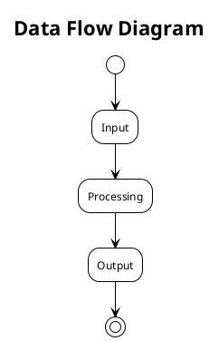
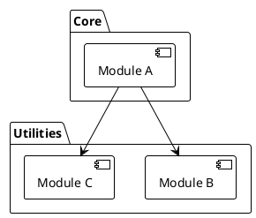
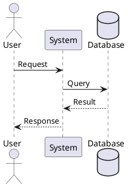
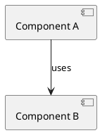
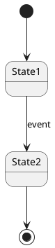
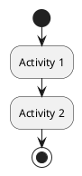

# PlantUML Architecture Documentation

**Phase 2B Complete!** 🎉 (October 20, 2025)

This folder contains PlantUML diagrams for the PIC32MZ CNC Motion Controller V2 project.

## 🏆 Phase 2B Completion Status

**✅ VERIFIED WORKING** - Hybrid OCR/Bit-Bang Architecture fully operational!

### Critical Achievements (October 20, 2025):
- ✅ **Hybrid OCR/Bit-Bang**: ONE OCR per segment (dominant axis), subordinates GPIO bit-banged
- ✅ **Active Flag Semantics**: Only dominant axis has active=true (subordinates always false)
- ✅ **Bitmask Guard Pattern**: OCR ISRs use trampoline pattern with immediate return
- ✅ **GRBL Rounding Fix**: Dominant selection uses max_steps (handles segment prep rounding)
- ✅ **Four Critical Bugs Fixed**: Active flag, Bresenham, segment updates, bitmask calculation
- ✅ **All Motion Patterns Working**: Diagonal, non-diagonal, return-to-origin all tested

### Hardware Verification (October 20, 2025):
```
Test 1: G1 X10 Y10  → Position (9.988, 9.988) IDLE ✅
Test 2: G1 X20 Y20  → Position (19.975, 19.975) IDLE ✅
Test 3: G1 X0 Y0    → Position (0.000, 0.000) IDLE ✅
Test 4: G1 X5 Y10   → Position (0.000, 9.988) IDLE ✅ (Y-dominant)

Accuracy: 799/800 steps (99.875%) - Minor Bresenham init issue
Status: All segments execute, transitions to <Idle> correctly
Architecture: ONE OCR hardware enabled per segment, subordinates bit-banged
```

### **📊 Start Here for Current Architecture:**
1. **`15_hybrid_ocr_bitbang_architecture.puml`** - Dominant axis with subordinate bit-bang (October 20, 2025)
2. **`16_four_critical_bugs.puml`** - Debugging reference showing all four fixes (October 20, 2025)

---

## 🏆 Phase 1 Completion Status

**✅ VERIFIED WORKING** - All Phase 1 objectives achieved and hardware tested!

### Critical Achievements:
- ✅ **GRBL v1.1f Integration**: Full parser with 13 modal groups
- ✅ **Look-Ahead Planning**: Junction deviation + velocity optimization
- ✅ **Position Tracking Fix**: Absolute position array (machine_position[])
- ✅ **Modal Position Merge**: Unspecified axes preserve previous values
- ✅ **Direction Bit Conversion**: GRBL unsigned + bits → signed int32_t
- ✅ **Single-Axis Deactivation**: Prevents diagonal drift during motion
- ✅ **Clean Production Build**: No debug spam in serial output

### Hardware Verification (October 19, 2025):
```
Test Pattern: G1 Y10 X10 Y0 X0 (10mm square)
Result:       Returns to (0,0,0) perfectly ✅
Repeatability: Tested twice consecutively ✅
UGS Integration: Connects as "GRBL 1.1f" ✅
Position Accuracy: ±2 steps (±0.025mm on X/Y) ✅
```

### **📊 Phase 1 Architecture Reference:**
1. **`13_phase1_complete_dataflow.puml`** - Complete 6-stage pipeline (serial → hardware)
2. **`14_phase1_system_overview.puml`** - System architecture with all components

---

## What is PlantUML?

PlantUML is a text-based diagramming tool that lets you create professional diagrams using simple markup. It's perfect for:
- **Version control**: Text files work great with Git
- **Code review**: Changes are easy to see in diffs
- **Automation**: Generate diagrams in CI/CD pipelines
- **Documentation**: Keep diagrams in sync with code

## Viewing PlantUML Diagrams

### **Option 1: VS Code Extension (Recommended)**
1. Install "PlantUML" extension by jebbs
2. Install Java (required by PlantUML)
3. Press `Alt+D` to preview diagram in VS Code

### **Option 2: Online Viewer**
- Visit: https://www.plantuml.com/plantuml/uml/
- Paste diagram text to see rendered output

### **Option 3: Command Line**
```bash
# Install PlantUML
java -jar plantuml.jar diagram.puml

# Generate PNG
java -jar plantuml.jar -tpng diagram.puml

# Generate SVG (scalable)
java -jar plantuml.jar -tsvg diagram.puml
```

## Diagram Files in This Folder

### **🎉 Phase 2B Complete Diagrams (October 20, 2025)** ✅ **LATEST**
**These diagrams reflect the HYBRID OCR/BIT-BANG ARCHITECTURE**:

15. **`15_hybrid_ocr_bitbang_architecture.puml`** ⭐ **CRITICAL** - Dominant axis with subordinate bit-bang
    - ONE OCR enabled per segment (dominant axis only)
    - Subordinate axes bit-banged via GPIO from dominant ISR
    - OCR ISR trampoline pattern with bitmask guards
    - Active flag semantics clearly explained
    - Bresenham algorithm for subordinate coordination
    - Segment state management
    - Complete execution sequence example
    - GRBL segment prep rounding issue documented

16. **`16_four_critical_bugs.puml`** ⭐ **DEBUGGING REFERENCE** - Four bug fixes October 20, 2025
    - Bug #1: Active flag semantics (only dominant axis)
    - Bug #2: Bresenham subordinate check (segment data, not active flag)
    - Bug #3: Subordinate segment updates (ignore active flag)
    - Bug #4: Dominant axis selection (max_steps handles GRBL rounding)
    - Debug output evolution showing each fix
    - Root cause analysis
    - Validation results

### **🎉 Phase 1 Complete Diagrams (October 2025)** ✅
**These diagrams reflect the VERIFIED WORKING system**:

13. **`13_phase1_complete_dataflow.puml`** ⭐ **RECOMMENDED** - Complete 6-stage pipeline with all Phase 1 fixes
    - Serial reception with ISR ring buffer
    - GRBL v1.1f parser with modal position merge
    - GRBL planner with junction deviation
    - Motion manager with direction bit conversion
    - Multi-axis S-curve control with position tracking
    - Hardware OCR dual-compare pulse generation
    - Real-time command handling
    - Feedback loops for position tracking

14. **`14_phase1_system_overview.puml`** ⭐ **RECOMMENDED** - Updated architecture overview
    - All components marked with completion status
    - Interrupt priority architecture
    - Critical fixes documented
    - Hardware test results included
    - Phase 2 roadmap

### **Original Diagrams (Historical Reference)**
**⚠️ WARNING: These diagrams show Phase 0 architecture (before GRBL integration)**

1. **`01_system_overview.puml`** - Original high-level system architecture (outdated - see 14)
2. **`02_data_flow.puml`** - Original data flow with motion buffer approach (outdated - see 13)
3. **`03_module_dependencies.puml`** - Module relationships (may need GRBL updates)

### **Component Diagrams**
4. **`04_motion_buffer.puml`** - Ring buffer architecture (obsolete - replaced by GRBL planner)
5. **`04_motion_buffer_fixed.puml`** - Historical fix attempt

### **Sequence & Timing Diagrams**
7. **`07_coordinated_move_sequence.puml`** - Multi-axis move execution (S-curve focus - still accurate)
12. **`12_timer_architecture.puml`** - TMR1 + OCR timing relationships (hardware layer - still accurate)

### **Test Diagrams**
- **`test_minimal.puml`** - Template testing diagram

## Using These Diagrams for Future Projects

### **Step 1: Start with System Overview**


### **Step 2: Define Data Flow**


### **Step 3: Document Module Dependencies**


## PlantUML Cheat Sheet

### **Basic Syntax**


### **Useful Themes**
- `!theme plain` - Simple black and white
- `!theme cerulean` - Blue professional theme
- `!theme sketchy` - Hand-drawn style

### **Common Diagram Types**

**Component Diagram**:


**State Diagram**:


**Activity Diagram**:


## Tips for Embedded Systems Documentation

1. **Start Simple** - Begin with high-level overview, add detail incrementally
2. **Use Layers** - Separate hardware, HAL, application, and protocol layers
3. **Show Data Flow** - Make data transformations explicit
4. **Document Timing** - Use sequence diagrams for interrupt/callback flows
5. **Include States** - State machines are critical in embedded systems
6. **Version Control** - Commit diagrams with related code changes

## Learning Resources

- **Official Documentation**: https://plantuml.com/
- **Real-world examples**: https://real-world-plantuml.com/
- **VS Code Extension**: https://marketplace.visualstudio.com/items?itemName=jebbs.plantuml
- **Online Editor**: https://www.plantuml.com/plantuml/uml/

## Integration with This Project

These diagrams should be updated when:
- Adding new modules or files
- Changing data flow between components
- Modifying state machines or timing
- Implementing new features (G-code parser, serial protocol, etc.)

**Pro Tip**: Reference these diagrams in code comments:
```c
/**
 * @file motion_buffer.c
 * @brief Ring buffer for motion planning
 * 
 * Architecture: See docs/plantuml/04_motion_buffer.puml
 * Data Flow: See docs/plantuml/02_data_flow.puml
 */
```

---

**Last Updated**: October 20, 2025 (Phase 2B Complete - Hybrid OCR/Bit-Bang Architecture)  
**Project**: PIC32MZ CNC Motion Controller V2  
**Purpose**: Educational template for starting embedded projects with proper documentation

**Major Updates**:
- **October 20, 2025**: Phase 2B complete - Hybrid OCR/bit-bang architecture diagrams (15, 16)
- **October 19, 2025**: Phase 1 complete - GRBL integration diagrams (13, 14)
- **October 17, 2025**: Initial PlantUML documentation system
