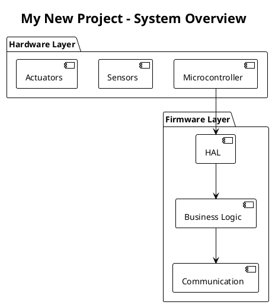
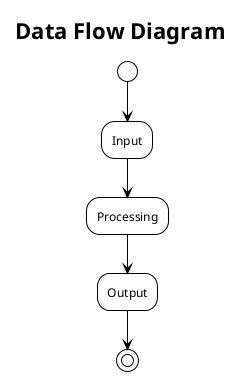
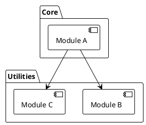
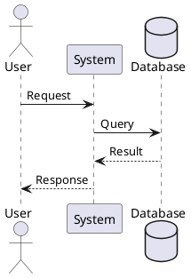
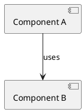
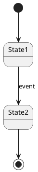
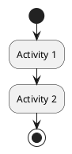

# PlantUML Architecture Documentation

This folder contains PlantUML diagrams for the PIC32MZ CNC Motion Controller V2 project.

## What is PlantUML?

PlantUML is a text-based diagramming tool that lets you create professional diagrams using simple markup. It's perfect for:
- **Version control**: Text files work great with Git
- **Code review**: Changes are easy to see in diffs
- **Automation**: Generate diagrams in CI/CD pipelines
- **Documentation**: Keep diagrams in sync with code

## Viewing PlantUML Diagrams

### **Option 1: VS Code Extension (Recommended)**
1. Install "PlantUML" extension by jebbs
2. Install Java (required by PlantUML)
3. Press `Alt+D` to preview diagram in VS Code

### **Option 2: Online Viewer**
- Visit: https://www.plantuml.com/plantuml/uml/
- Paste diagram text to see rendered output

### **Option 3: Command Line**
```bash
# Install PlantUML
java -jar plantuml.jar diagram.puml

# Generate PNG
java -jar plantuml.jar -tpng diagram.puml

# Generate SVG (scalable)
java -jar plantuml.jar -tsvg diagram.puml
```

## Diagram Files in This Folder

### **System Architecture Diagrams**
1. **`01_system_overview.puml`** - High-level system architecture
2. **`02_data_flow.puml`** - Complete data flow from serial to motion
3. **`03_module_dependencies.puml`** - Module relationships and dependencies

### **Component Diagrams**
4. **`04_motion_buffer.puml`** - Ring buffer architecture
5. **`05_type_system.puml`** - Centralized type definitions
6. **`06_motion_math.puml`** - Motion math library structure

### **Sequence Diagrams**
7. **`07_coordinated_move_sequence.puml`** - Multi-axis move execution
8. **`08_gcode_parsing_sequence.puml`** - G-code parsing flow (future)
9. **`09_lookahead_planning_sequence.puml`** - Look-ahead algorithm

### **State Diagrams**
10. **`10_scurve_state_machine.puml`** - S-curve segment states
11. **`11_motion_buffer_states.puml`** - Buffer state transitions

### **Timing Diagrams**
12. **`12_timer_architecture.puml`** - TMR1 + OCR timing relationships
13. **`13_scurve_timing.puml`** - 7-segment S-curve timing

## Using These Diagrams for Future Projects

### **Step 1: Start with System Overview**


### **Step 2: Define Data Flow**


### **Step 3: Document Module Dependencies**


## PlantUML Cheat Sheet

### **Basic Syntax**


### **Useful Themes**
- `!theme plain` - Simple black and white
- `!theme cerulean` - Blue professional theme
- `!theme sketchy` - Hand-drawn style

### **Common Diagram Types**

**Component Diagram**:


**State Diagram**:


**Activity Diagram**:


## Tips for Embedded Systems Documentation

1. **Start Simple** - Begin with high-level overview, add detail incrementally
2. **Use Layers** - Separate hardware, HAL, application, and protocol layers
3. **Show Data Flow** - Make data transformations explicit
4. **Document Timing** - Use sequence diagrams for interrupt/callback flows
5. **Include States** - State machines are critical in embedded systems
6. **Version Control** - Commit diagrams with related code changes

## Learning Resources

- **Official Documentation**: https://plantuml.com/
- **Real-world examples**: https://real-world-plantuml.com/
- **VS Code Extension**: https://marketplace.visualstudio.com/items?itemName=jebbs.plantuml
- **Online Editor**: https://www.plantuml.com/plantuml/uml/

## Integration with This Project

These diagrams should be updated when:
- Adding new modules or files
- Changing data flow between components
- Modifying state machines or timing
- Implementing new features (G-code parser, serial protocol, etc.)

**Pro Tip**: Reference these diagrams in code comments:
```c
/**
 * @file motion_buffer.c
 * @brief Ring buffer for motion planning
 * 
 * Architecture: See docs/plantuml/04_motion_buffer.puml
 * Data Flow: See docs/plantuml/02_data_flow.puml
 */
```

---

**Generated**: October 17, 2025  
**Project**: PIC32MZ CNC Motion Controller V2  
**Purpose**: Educational template for starting embedded projects with proper documentation
